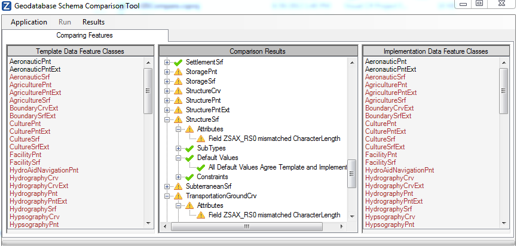

ArcGISCompare
=============

ArcObjects desktop application to perform a schema comparison between two file geodatabases, in order to support configuration management efforts. This application checks the presence of feature classes by name. For each feature class that exists in the two geodatabases, the application compares attributes, geometries, constraints (domains), and default values and reports differences. It checks schema only but does not inspect individual features.

This application requires ArcObjects and should execute with a valid license of either ArcGIS Desktop or ArcGIS Engine. It has been tested with ArcGIS 10.0 and 10.1.

-><-

